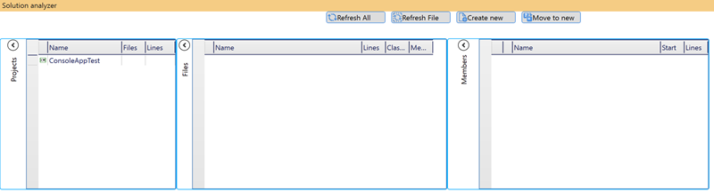

# Solution analyzer and file splitter 

## Overview ##
As I must to refactor old, not good written project I need to find large files and split it in some way.
There was single class files with about 10000 lines and functions with more that 1000 lines.
All refactoring actions was very slowly so I decide to split large classes in one big file to partial classes in small files.
For this task I have written Visual Studio package. 
The package window has command panel *(1)*, information panel (2), project info panel (3), files in project info panel (4), methods into selected class panel (5).


Methods could be selected and selected methods could be moved into a new part of the class.

For software developer I describe [possible troubles](SolutionAnalyzer/documentation/HowToMain.md) by developing a VS Package and create 
[documentation](SolutionAnalyzer/documentation/help/index.html) for my VS Package

## Limitations ##

It is possible to split and analyze first class in the file only. So try to use tools like resharper first.
It is possible to see how many classes are into the file into files panel.
Files with regions directive could be splitted wrong as there is no check for region directive.
Automatically refresh is not implemented. If you change file, project, solution then refresh analyzer state manually

## System requirements

Microsoft Visual studio 2019

## Additional libraries

[Attached Command Behavior](https://marlongrech.wordpress.com/2008/12/13/attachedcommandbehavior-v2-aka-acb/) - Use commands instead events.

[Mvvm Light Libs](http://www.mvvmlight.net/) - Set of components helping to get started in the Model-View-ViewModel pattern

[Xceed Grid open source](https://archive.codeplex.com/?p=wpfextendeddatagrid) - the last found opensource grid version under Microsoft Public License (MS-PL)

[Xceed Grid open source](https://archive.codeplex.com/?p=wpftoolkit) - The Extended WPF Toolkit™ is the number one collection of WPF controls, components and utilities for creating next generation Windows applications.
There is compatible version to the grid.

I need to use MS-PL licence too.


## Installation

## How to work
First, you need to open solution analyzer helper tool window. You can do it from Visual Studio menu *Tools* 


or from Visual Studio menu *Edit/Other Windows* 


Pay attention that in your version could be another menu sub items as in screen shot.

Then you can see the tools window if any project is open:


After project selection is possible to collapse project panel:

Selected project name and file name shown into the info line.

Into the Files panel it is possible to see all files into the selected project sorted by the lines. 
In addition there is class count per file and class member count. As class member counting is a long operation it is showed for selected files only.

Into the Members panel it is possible to see constructors, procedures and properties with start line number and line count.
If class member has some comments immediately before or after then theses comments will be calculated too.

After row double click class member will be selected into editor.

When you want to split the class, select one or more methods and press button move to new


Then instead the one class 

```C#
class TestClass : TestBase
{
    // comment before Method1
    public void Method1()
    {

    }//comment after Method1

    /// <summary>
    ///  test1
    ///  test2
    /// </summary>
    public void Method2()
    {

    }   //test3
}
```
we will have two


*TestClass.cs*
```C#
partial class TestClass : TestBase
{
    /// <summary>
    ///  test1
    ///  test2
    /// </summary>
    public void Method2()
    {
    } //test3
}
```

*TestClass.Part01.cs*
```C#
partial class TestClass
{
    // comment before Method1
    public void Method1()
    {

    }//comment after Method1
}
```

**Notes**:

- all *using* will be copied too.

- File grid and Members grid have context menu.

- it is possible to select class members like in Windows explorer with *Ctrl* and *Shift* keys.
  and after it use context menu item *Set check flag on selections*. 

